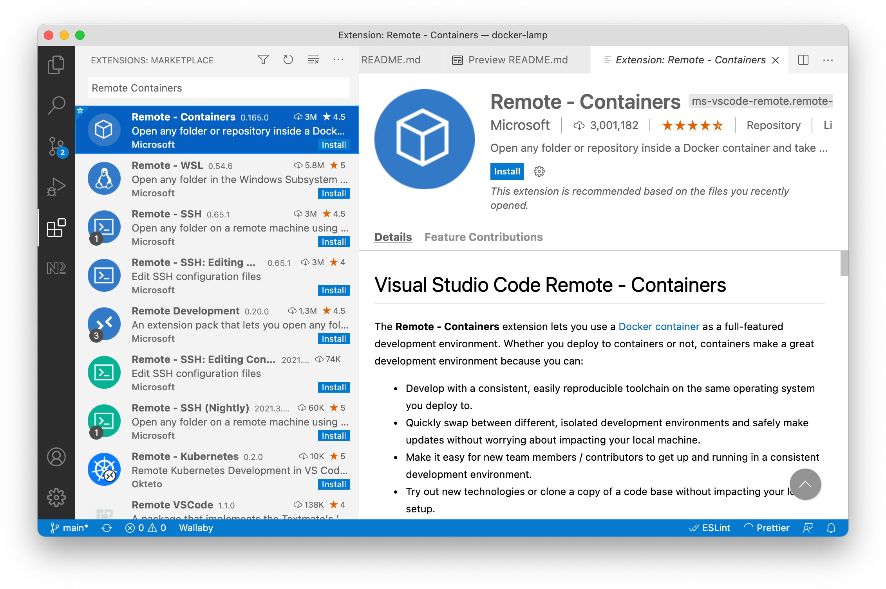
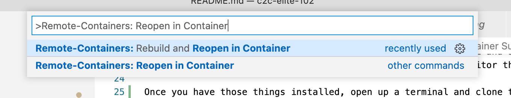
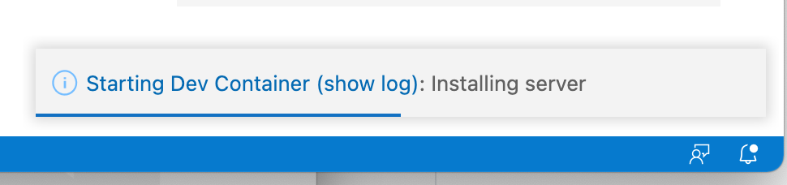

# LAMP Docker

A LAMP (Linux, Apache, MySQL, PHP) stack meant for development within VS Code Remote Containers. This stack is for **educational and development purposes only**  -- it's not intended as is for production deployments.

## What's Included
- PHP 7.4 + Apache. This runs in the `{PROJECT}`_app container. Node is also installed on this container to facilitate asset toolchains (css, javascript, etc.)
- MySQL (MariaDb) running in the `{PROJECT}`_database container.
- phpMyAdmin (an admin app for looking at your database) running in the `{PROJECT}`_phpmyadmin container.

In addition, the following VS Code extensions are installed when you open the project as a dev container:

- felixfbecker.php-debug: Debugging PHP code in the editor.
- bmewburn.vscode-intelephense-client: Intellisense (code completion) for php
- mrmlnc.vscode-apache: Intellisense for apache config files
- esbenp.prettier-vscode: Formatter for code, enforcing consistent style

## Getting Started
**Prerequisites**

You need to have the following installed:

- git: https://git-scm.com/book/en/v2/Getting-Started-Installing-Git 
- Docker Desktop: https://www.docker.com/products/docker-desktop 
- VS Code: https://code.visualstudio.com/ 

**Steps**

Make sure Docker Desktop is running. Assuming you have not used Docker before, you should see something like this:

Note that the background of the whale on the bottom left is green. This means Docker is ready to go.

Open up VS Code. In VS Code, open up Extensions (`View -> Extensions`.) Type "Remote Containers" into the search box. Click on "Remote Containers, then click "Install."

If you already have a project open, open a new blank workspace (`File -> New Window`.)

Click "Clone Repository."

Paste the URL of this repo into the box. https://github.com/cdcarson/docker-lamp.git. You'll be asked to choose a parent folder into which the the repo will be cloned.

You should be prompted to reopen the workspace in a dev container:

Click "Reopen in Container." If you don't see this prompt, you can always open in via the [Command Palette](https://code.visualstudio.com/docs/getstarted/userinterface#_command-palette). Select "Reopen in Container":

VS Code will tell Docker to start the containers...

The first time you run this it will take a significant amount of time (like 5 or 10 minutes) to complete. Docker is downloading and compiling a whole bunch of source code. Don't worry -- the next time it'll only take a few seconds. 

Look at Docker Desktop

